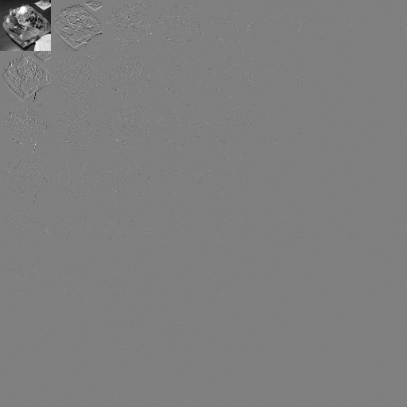
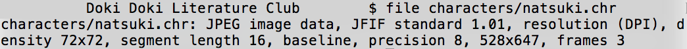
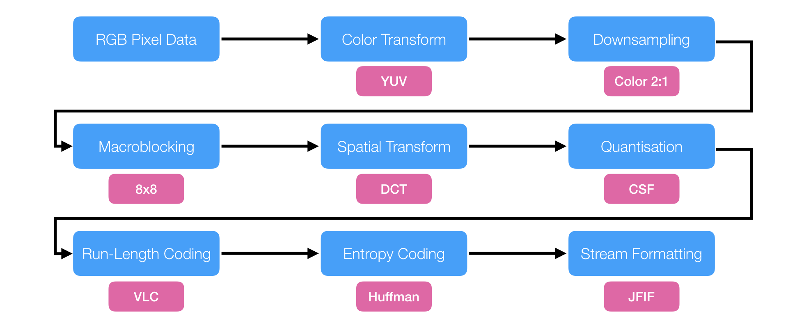

# Lesson 1 - JPEG

## JPEG, the Committee

JPEG stands for *Joint Photographic Experts Group*, and is one of the sub-subcommittees of ISO (Subcommittee 29, Working Group 1). Yes, *that* ISO that regulates a bunch of international standards, and also what the `.iso` CD image format is named after.

In very, very simple terms, it's a committee (*group*) of many (*joint*) PhDs and industry researchers (*experts*) that likes image compression (*photographic*) and gathers up about two to three times a year - [in various locations around the world][Wikipedia link] - to show progress on [different areas of the different projects they're working on][link to jpeg's website], and make [book-long specification documents][ISO site selling the specs] telling everyone who is either a member of ISO, or can afford one of their specs, how to **exactly** implement a given *decoder* for a given media codec. MPEG (another ISO sub-subcommittee) works much the same way.

But *not* an encoder - as long as the encoder *produces a valid file for the decoder described in the spec*, its implementation is up to anyone's imagination (and girl, *do those implementations differ wildly*). Usually, but not always, those documents come with a refence decoder and encoder code samples that aren't very efficient, but produce correct streams and are a great starting point for making better software - or hardware - implementations.

The JPEG has a couple next-gen projects they're working on, like JPEG XS, JPEG XL, the finished-but-never-got-mainstream JPEG 2000, and even JPEG Pleno for 4D ([light field][lytro link]/[point cloud][MS research]/[voxel][Minecraft]) images, but for the next five years or so, the only real threats to JPEG are [BIG][link] and [HEIF][link]; both due to 50% smaller files and ready-made hardware support by re-purposing the [H.265][some informative link] video codec. The present, however, belongs entirely to JPEG and is likely to stay as such.

Unless either Apple, Google, or Facebook deprecate JPEG in their platforms.

## JPEG, the Image Codec

The "JPEG image format" everyone knows and was first finished in 1992 is retroactively known as *JPEG-1*, and this is what we're working with here. Some of its main characteristics are that it's a *lossy*, *color transforming*, *spatial transforming* codec. Each of the lessons in this tutorial covers an aspect and building block of JPEG, and each one will build on top of another as we make a JPEG-like, but incompatible, homemade image codec replacement (dubbed HMI). We'll glance over the major characteristics here.

### Lossy

JPEG is a *lossy* image codec - as opposed to a *lossless* one. This means that (usually but not always) JPEG images *cannot* be decoded exactly to their original input images - JPEG cleverly removes or downplays some elements of the original image in order to achieve its venerable compression rate.

Due to the way JPEG transforms and handles its data, however, JPEG isn't meant to be an all-purpose image codec: images that have very sharp edges - such as logos, text, and digital illustrations - suffer heavily from the way JPEG compresses, and therefore are more suited to a *lossless* codec such as PNG or [GIF](About GIF.md). Plus, JPEG has no support for an alpha channel (transparency); anything that requires it cannot rely on standard JPEG.

### Color Transforming

JPEG is a *color transforming* codec - it exploits the fact that countless experiments done from the 19th century all the way to today show that humans are much more sensitive to contrast changes, rather than color changes. JPEG's weapon of choice is the [YUV transform][Wikipedia link], which first breaks a full-color RGB image into three separate monochromatic ones:

* The Y image, which is an **approximation** of how humans would see that image if it was purely black-and-white; in other words, the *contrast* image, and the one given highest priority.
* The U image, which is an abstract "color difference" plane, telling how much each pixel varies from the Y plane in the blue-yellow color axis.
* The V image; same thing as the U plane, but in the red-green axis.

### Spatial Transforming

JPEG is a *spatially transforming* codec - it transforms (applies some well-defined, reversible mathematical operation to) its input data in order to better compress it, when the time comes to quantize the data (the step that *removes* information from the image, and is necessary so that entropy coding can be effective). JPEG's weapon of choice is the [DCT transform][Wikipedia link], that approximately breaks down an image into 64 (8x8) individual frequency components, all derived from the cosine function.

It may sound counter-intuitive the first time you hear about "frequencies" when talking about images, because we don't often talk about images having "bass" or "treble", using the familiar musical terms. But there is a direct analog there: "blurriness" and "sharpness". The "sharper" an image is, the more high-frequency components it has; the "blurrier" it is, the less it has. The image below is broken down into JPEG's 64 frequency components, so you can "see" more or less what those "frequencies" we're talking about are.

## JPEG, the Image Container

Finally, JPEG isn't just an image codec, but also an image *container*. The *JFIF* standard (an annex to the JPEG spec - whose extended version became the *EXIF* container, popular with digital cameras and smartphones) describes a way to pack a raw JPEG stream into a file ready for viewing on web browsers, phones, cameras, TVs, and all devices that comply to the JFIF standard. You actually don't have to pack a JPEG stream into a JFIF (.jpg) container: you could as well pack it into a Matroska (.mkv), Ogg (.ogg), or Windows MetaFile (.wmf) container and have the same image nevertheless. You don't even have to use the correct extension for a JFIF container: it has a well-defined file header, telling any interested application it *is* a JFIF file when trying to open it. You could actually use this fact to disguise any JFIF file with a false extension, as the game [Doki Doki Literature Club][link to DDLC wiki] does: a testament to how robust JFIF is.

## Block Diagram

An overview of all the processing steps that a traditional 3-color channel (RGB) image goes, from raw pixels to the final .jpg file, is given in the diagram below - along with JPEG-1's algorithm choices for each of those steps. Blue rectangles represent the overall concepts, whereas pink rectangles denote JPEG's specific choices for each algorithm.

Our goal with HMI is to replace those pink blocks one by one with more modern alternatives, and gradually build up our own image codec using the same foundation laid out by JPEG.