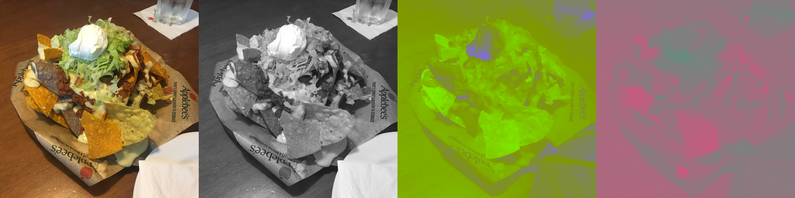
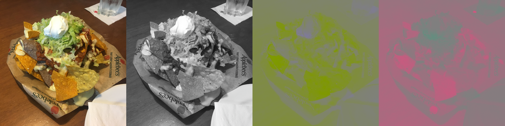

# Lesson 2 - Color Transform

If we zoom in on the first block of our diagram on how JPEG works, we'll see that the first step in our compression toolchain is *color transformation*.

All of JPEG's compression steps, be them lossy or lossless, have the common characteristic of trying to *decorrelate data as much as possible*; this means that anything that we, as humans, can't perceive very well will either be numerically simplified or just thrown away. And color is one such information.

## Recap

Recall from the previous lesson that JPEG first splits up an image into three separate "planes": Y, U, and V. Quoting from the previous lesson:

> * The Y image, which is an **approximation** of how humans would see that image if it was purely black-and-white; in other words, the *contrast* image, and the one given highest priority.
> * The U image, which is an abstract "color difference" plane, telling how much each pixel varies from the Y plane in the blue-yellow color axis.
> * The V image; same thing as the U plane, but in the red-green axis.
>
> 

## The colorful truth

I admittedly had to cheat a little bit when generating this image: the "color difference" planes, U and V, are actually **scaled** from their original values (in terms of contrast), just so the difference can clearly be seen. I don't have perfect vision, and my computer monitor isn't the fanciest, most color-correct in the world; I know, however, that my eyes have a hard time resolving detail with the U and V planes; I can mostly see blobs of color, but hardly the edges. Here's what the original image looks like, unscaled:

The Y plane, on the other hand, is very easy to see. This is due to the physiological nature of your eyes: [humans are about 10x more sensitive to *contrast* (bright/dark) changes than *hue* (color) changes][some link to human eye physiology]. There's some variation here and there, and some people have better or worse color separation than others (anomalies such as dichromats and tetrachromats exist, too), but using the average human as a model we know we can reduce the importance of color information in relation to contrast information without a significant degradation to the color impressions a person has when seeing an image. This is motivated by our next step in the compression chain, *downsampling*, where we'll discard some parts of the color information.

## Why YUV

The YUV transform was known back in the analog days as the YCbCr color model, which you might be familiar if you've ever seen an analog *component video* input in the back of your TV - the triad of green, blue, and red cables connecting some device to it, with better quality than the single *composite video* (yellow) cable, before there was HDMI.

And that is a slighly better name for it, in my opinion: *slightly* because **Y** still doesn't make much sense (it's inherited from a 1930's French color scientist's work, who created the ["XYZ" color model][link to CIE XYZ]), but at least Cb stands for *Complementary blue*, and Cr for *Complementary red* - makes sense, given the description above that the U/Cb plane deals with the blue-yellow color axis differences (complements), and the V/Cr plane deals with the red-green axis.

It has been proposed back in the 50s, when engineers were faced with the task of transmitting color together with black-and-white images through the television system, in a backwards compatible manner: a B&W display would only read the Y signal, whereas a color display could also read and decode the color differences Cr and Cb. And so it got carried over to the digital realm when the first experiments with digital photography and video were carried on in the late 70s, remaining with us until this day.

## YUV's limitations

YUV isn't the only color transform we can use for our codec, and there are actually a couple good reasons we won't while developing HMI.

### 1. YUV is (or used to be) expensive

Believe it or not, transforming YUV back to RGB in real-time was a massive struggle for early video codecs, and one of the first functions "2D accelerator cards" of the 90's provided in hardware. As a linear transform, YUV can be defined in terms of a matrix multiplication, defined as follows.

If you don't know how matrix multiplication works, don't worry; just know that for each pixel we need 9 multiplications and 6 sums to go from one color space to the other. If we take a low-resolution, 320x240 image at 30 frames per second and tally up the computing power needed to simply *display* a raw YUV video into a computer monitor, we end up with 20,7 and 13,8 million multiplies and additions, respectively.

This was unthinkable when most desktop PCs didn't have floating-point units (FPUs), and had to resort to long, slow chains of multiplications to simulate the higher precision they offered compared to integer multiplication - which itself was also massively slow, costing about 30 to 70 clock cycles for both an Intel 8086 or a Motorola 68000 (mid-80s CPUs). Clocked at the usual 8MHz of the day, they could only decode **an image every eight seconds**.

Most hardware and CPUs from the period "cheated", however, and used a truncated, 8-bit model that could run only with integer multiplication, instead of relying on floating point. And, since the coefficients were constants, you can always replace the multiplication with an 8-bit look-up table, having a signficant speed-up at the cost of some kilobytes of RAM: the above example with the 68000 could be improved to about an image per second. It was still slow enough to the point only DSPs and specialized hardware could do it in real-time, however.

This isn't a problem nowadays, and is one of the least expensive operations in JPEG, in fact - we can do the full-precision YUV transform in hundreds of images a second, even for high-resolution images, using either CPUs or programmable GPUs.

### 2. Downsampled YUV has artifacts

A *modern* reason for replacing YUV, however, has to do with an artifact I call "red banding". Whenever there is a large segment of red, contrasting with either white or black on the screen, the downsampling on the V channel becomes the most noticeable - it breaks the illusion that such downsampling isn't losing any perceptible color detail; you become aware you're looking at a lower resolution image. I suspect this is the reason you see fewer logos with large red segments on the internet compared to real life, [despite red being the most distinguishable color to humans][link color naming evolution].

This affects all sorts of entirely red-saturated objects with very sharp edges: text, flowers, cars, neon signs, red ink, blood. By the same token, cyan (the complementary color of red in the RGB color space) should be equally affected; is isn't as perceptible, however, because humans are more sensitive to red than blue. Other completely saturated colors in the RGB color space, such as blue, green, pink, and yellow don't suffer much or at all from banding.

## Our alternative: the VCoCg model

We're instead going to use a modern alternative proposed in the late 2000's, called the YCoCg color transform - Co for *Complementary orange*, and Cg for *Complementary green*. It was originally designed for simpler hardware implementation than the YUV transform, requiring only additions, subtractions, and bit-shifts - as opposed to the truckload of multiplications YUV requires. Interestingly enough, it looks perceptually better than YUV in some scenarios, and at least to my subjective assessment, it doesn't suffer from "red banding" - or any other kind of severe saturated color banding when downsampled.

Now, let's develop some code telling Octave/MatLAB how to convert an image from RGB into YUV.